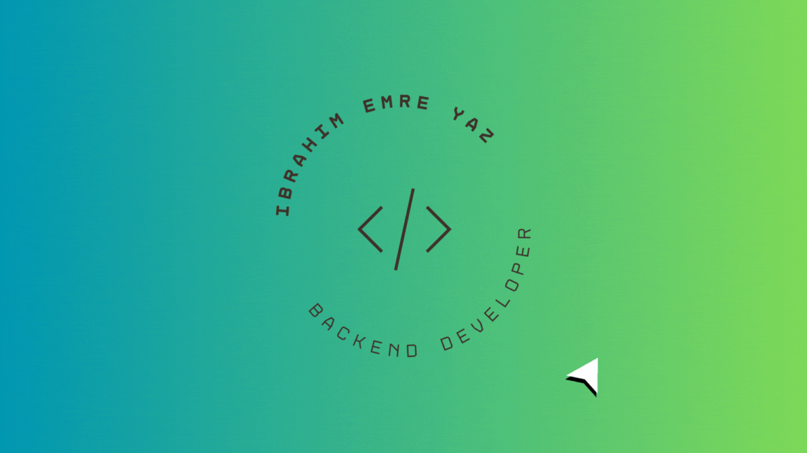

<a href="https://emre-yaz.github.io/">
  
</a>


<!--START_SECTION:waka-->


**🐱 My GitHub Data** 

> 📦 16.1 kB Used in GitHub's Storage 
 > 
> 🏆 117 Contributions in the Year 2023
 > 
> 💼 Opted to Hire
 > 
> 📜 6 Public Repositories 
 > 
> 🔑 2 Private Repositories 
 > 
**I'm a Night 🦉** 

```text
🌞 Morning                0 commits           ░░░░░░░░░░░░░░░░░░░░░░░░░   00.00 % 
🌆 Daytime                5 commits           █░░░░░░░░░░░░░░░░░░░░░░░░   03.12 % 
🌃 Evening                134 commits         █████████████████████░░░░   83.75 % 
🌙 Night                  21 commits          ███░░░░░░░░░░░░░░░░░░░░░░   13.12 % 
```
📅 **I'm Most Productive on Thursday** 

```text
Monday                   9 commits           █░░░░░░░░░░░░░░░░░░░░░░░░   05.62 % 
Tuesday                  17 commits          ███░░░░░░░░░░░░░░░░░░░░░░   10.62 % 
Wednesday                7 commits           █░░░░░░░░░░░░░░░░░░░░░░░░   04.38 % 
Thursday                 57 commits          █████████░░░░░░░░░░░░░░░░   35.62 % 
Friday                   11 commits          ██░░░░░░░░░░░░░░░░░░░░░░░   06.88 % 
Saturday                 29 commits          █████░░░░░░░░░░░░░░░░░░░░   18.12 % 
Sunday                   30 commits          █████░░░░░░░░░░░░░░░░░░░░   18.75 % 
```


📊 **This Week I Spent My Time On** 

```text
💬 Programming Languages: 
HTML                     1 min               █████████████████████░░░░   85.51 % 
Git                      0 secs              ███░░░░░░░░░░░░░░░░░░░░░░   11.00 % 
Git Config               0 secs              █░░░░░░░░░░░░░░░░░░░░░░░░   03.50 % 

🐱‍💻 Projects: 
Emre-Yaz.github.io       1 min               █████████████████████████   100.00 % 
```

**I Mostly Code in JavaScript** 

```text
JavaScript               2 repos             ████████░░░░░░░░░░░░░░░░░   33.33 % 
HTML                     2 repos             ████████░░░░░░░░░░░░░░░░░   33.33 % 
EJS                      1 repo              ████░░░░░░░░░░░░░░░░░░░░░   16.67 % 
MATLAB                   1 repo              ████░░░░░░░░░░░░░░░░░░░░░   16.67 % 
```


 Last Updated on 14/12/2023 21:31:38 UTC
<!--END_SECTION:waka-->


<!--
**Emre-Yaz/emre-yaz** is a ✨ _special_ ✨ repository because its `README.md` (this file) appears on your GitHub profile.
-->
